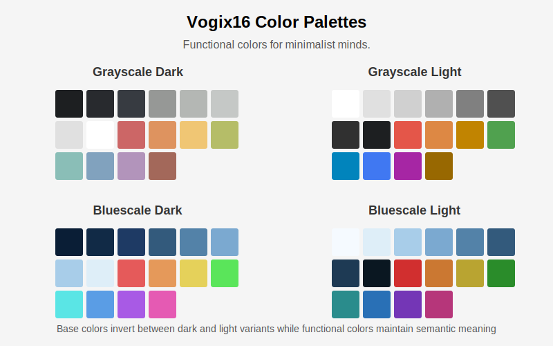

# Vogix16 Scheme Design System

> Functional colors for minimalist minds.

## Color Scheme Philosophies

Vogix supports 4 color schemes, each with a distinct philosophy. This document focuses on the vogix16 scheme, which is the default in Vogix.

| Scheme | Philosophy | Use Case |
|--------|------------|----------|
| **vogix16** | Semantic design system - colors convey functional meaning | Users who want colors to communicate status (errors, warnings, success) |
| **base16** | Syntax highlighting standard - 16 colors for code categories | Developers wanting consistent syntax highlighting across editors |
| **base24** | Extended syntax highlighting with bright colors | Developers wanting more color variety in syntax highlighting |
| **ansi16** | Terminal ANSI standard - traditional color mappings | Users wanting familiar terminal color behavior |

The documentation below focuses on the **vogix16 scheme philosophy**. Other schemes follow their respective standards.

Vogix uses vogix16 as the default scheme unless configured otherwise.

## Vogix16 Scheme Definition

The vogix16 scheme is inspired by Base16, but with key differences:

### Base Colors (Monochromatic UI Foundation)

When using vogix16 in NixOS/home-manager, these colors are exposed with semantic names:

- **base00** (`background`): Main background - Primary surface color (darkest in dark mode, lightest in light mode)
- **base01** (`background-surface`): Alternative surfaces - Secondary panels, cards, subtle containers
- **base02** (`background-selection`): Selection background - Hover states, active selections
- **base03** (`foreground-comment`): Comments - Disabled content, subtle text, placeholders
- **base04** (`foreground-border`): Borders & dividers - Separators, outlines, structural elements
- **base05** (`foreground-text`): Main text - Primary content text and interface elements
- **base06** (`foreground-heading`): Headings - Emphasized content, important text
- **base07** (`foreground-bright`): High contrast - Highest visibility elements (lightest in dark mode, darkest in light mode)

### Functional Colors (Semantic Purpose Colors)

When using vogix16 in NixOS/home-manager, these colors are exposed with semantic names:

- **base08** (`danger`): Error/danger - Error states, destructive actions, critical alerts
- **base09** (`warning`): Warning/caution - Warning indicators, important notifications, cautionary elements
- **base0A** (`notice`): Notice/attention - Status notifications, announcements, noteworthy information
- **base0B** (`success`): Success/confirmed - Success states, completed actions, positive indicators
- **base0C** (`active`): Active/current - Current selection, active element, focused content
- **base0D** (`link`): Links/interactive - Clickable elements, links, primary actions, informational content
- **base0E** (`highlight`): Focus/highlight - Focus indicators, highlighted content, secondary actions
- **base0F** (`special`): Special states - System messages, specialized indicators, tertiary elements

> **Important**: vogix16 defines functional colors by their semantic purpose, not by specific hues. While traditional color associations (red for errors, green for success) may be used, they are not required. What matters is that each functional color maintains its semantic meaning consistently across all interfaces and themes.

### Key Differences from Base16

1. **Monochromatic Base**: The base colors (base00-base07) form a monochromatic scale but aren't limited to grayscale. They can be any color family (green, blue, sepia, etc.), as long as they form a cohesive progression from darkest to lightest (or vice versa for light themes).

2. **Dark and Light Variants**: Themes have both dark and light variants. In dark variants, base00 is the darkest color and base07 is the lightest. In light variants, this is reversed: base00 is the lightest and base07 is the darkest.

3. **Strict Functional Color Usage**: Colors are assigned based on semantic function rather than aesthetics. Each functional color has a consistent purpose (e.g., base08 always represents errors/danger) even if the actual color used varies between themes.

4. **Not an ANSI Color Scheme**: vogix16 is a design system, not an ANSI terminal color scheme. Applications receive vogix16 colors through their own configuration files with semantic color names, not through ANSI escape codes.

## Semantic Color Usage

The core principle of vogix16 is using functional colors only when they convey information the user needs to know.

### Decision Framework

Ask yourself: **"Does this color communicate status, state, or information the user needs?"**

**YES - Use Functional Colors:**
- Error states, failures → `danger`
- Success confirmations, completions → `success`
- Warnings, cautions, alerts → `warning`
- Important notices → `notice`
- Resource utilization levels (CPU at 90% vs 10%)
- Temperature/status gradients (cool → warm → hot)
- Currently active/selected/focused items → `active`
- Interactive elements, links → `link`
- Highlighted content, focus indicators → `highlight`
- Added/removed/modified content (git diffs, file changes)

**NO - Use Monochromatic Base Colors:**
- UI borders, dividers, structural elements
- File type differentiation (unless indicating errors/warnings)
- Syntax highlighting purely for aesthetics
- Category labels without status meaning
- Navigation elements
- Decorative accents
- Organizational groupings

### Practical Examples

**System Monitor (btop):**
- ✓ CPU gradient: low → `foreground-comment`, moderate → `warning`, high → `danger` (semantic: user needs to know utilization)
- ✓ Selected item → `active` (semantic: indicates current focus)
- ✗ Box borders → all use `foreground-border` (not semantic: just structure)

**Version Control (git):**
- ✓ Added lines → `success` (semantic: successful addition)
- ✓ Removed lines → `danger` (semantic: deletion)
- ✓ Modified hunks → `warning` (semantic: pending changes)
- ✗ File paths, line numbers → monochromatic (not semantic: just structure)

**File Listings (ls/eza):**
- ✓ Permission errors → `danger` (semantic: access denied)
- ✓ Symbolic link errors → `warning` (semantic: broken link)
- ✗ File types (directories, executables) → monochromatic (not semantic: just categorization)

## Application Integration

### Direct Configuration (Recommended)

Applications should integrate with vogix16 by:
- Reading vogix16 configuration files with semantic color names
- Mapping semantic names to their own color requirements
- Following vogix16's minimalist principles in their color usage

**Supported applications**: btop, alacritty (UI), neovim, vim, tmux, and more (see `nix/modules/applications/`)

#### Example: btop (System Monitor)

btop demonstrates proper semantic color usage:

**Monochromatic (structural elements):**
- All box borders → `foreground-border` (same color, no semantic meaning)
- Main text → `foreground-text`
- Titles → `foreground-heading`
- Graph text → `foreground-text`

**Semantic (functional indicators):**
- CPU usage gradient: low → `foreground-comment`, moderate → `warning`, high → `danger`
- Temperature gradient: cool → `foreground-comment`, warm → `warning`, hot → `danger`
- Memory usage: low → `foreground-comment`, moderate → `warning`, high → `danger`
- Selected item → `active` (indicates current focus)

The key principle: Resource utilization levels ARE semantic information. The user needs to know when CPU is at 90% (danger) vs 50% (warning) vs 10% (normal). This is not decorative - it's functional color usage.

#### Example: git (Version Control)

Another proper semantic usage:

**Semantic:**
- Added lines → `success` (successful addition)
- Removed lines → `danger` (deletion/removal)
- Modified hunks → `warning` (changes pending review)

**Monochromatic:**
- File paths, line numbers, diff headers → monochromatic scale

### Terminal Emulator ANSI (Minimal Passthrough)

Terminal emulators (alacritty, Linux console) provide minimal ANSI color mappings:

**Minimal ANSI Mapping**:
- ANSI colors 0,7,8,15 → Monochromatic base (background, foreground, comments, bright)
- ANSI colors 1,9 (red) → `danger` (semantic: errors)
- ANSI colors 2,10 (green) → `success` (semantic: success states)
- ANSI colors 3,11 (yellow) → `warning` (semantic: warnings)
- ANSI colors 4,5,6,12,13,14 (blue/magenta/cyan) → Monochromatic foreground shades

This minimal mapping ensures:
- Terminal remains minimal by default
- Only semantic colors appear through ANSI passthrough
- Applications needing more colors should use direct vogix16 configs
- No "accidental" decorative colors from unconfigured applications

**Key Principle**: ANSI passthrough is a practical necessity, not the primary integration method. For full vogix16 support, applications should be configured directly with semantic color names.

